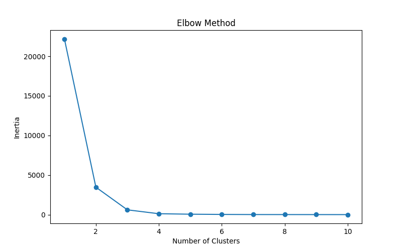
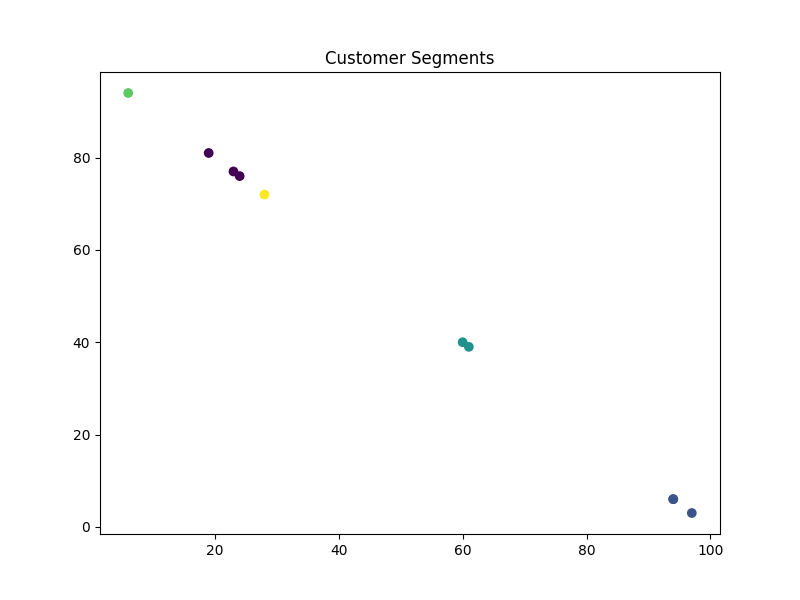
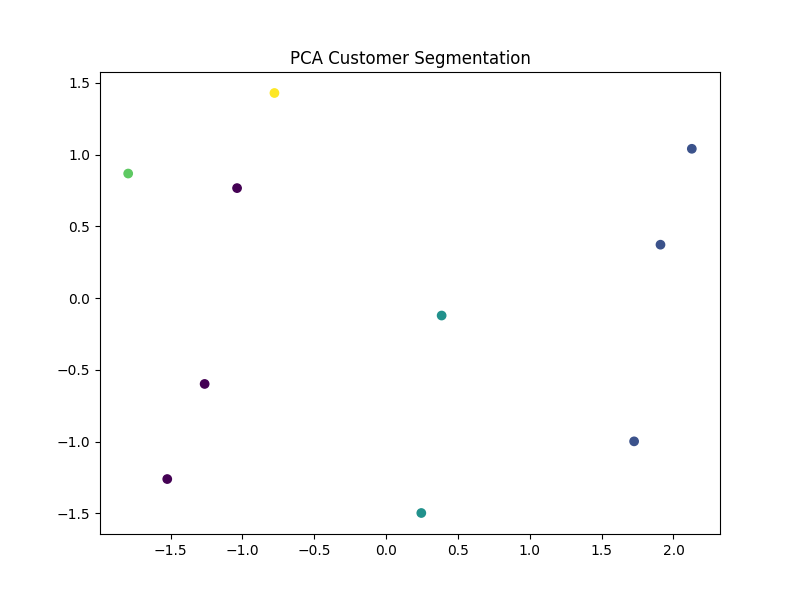

# Market & Customer Segmentation

## Overview

This project focuses on customer segmentation using Machine Learning techniques. The goal is to group customers based on their purchasing behavior and spending patterns so that businesses can create targeted marketing campaigns and improve customer engagement.

The project uses the Mall Customers Dataset and applies RFM (Recency, Frequency, Monetary) analysis, Principal Component Analysis (PCA), and K-Means Clustering to identify meaningful customer segments.

---

## Features

* Data preprocessing and cleaning
* Customer behavior analysis using RFM metrics
* Dimensionality reduction using PCA
* Customer segmentation using K-Means Clustering
* Elbow Method for optimal cluster selection
* Cluster profiling and business insights
* Data visualization using Matplotlib

---

## Project Structure

```text
Market_Customer_Segmentation/
│
├── dataset/
│   └── Mall_Customers.csv
│
├── outputs/
│   ├── elbow_method.png
│   ├── customer_clusters.png
│   ├── pca_clusters.png
│   └── cluster_report.csv
│
├── src/
│   ├── data_preprocessing.py
│   ├── rfm_analysis.py
│   ├── pca_analysis.py
│   ├── clustering.py
│   └── visualization.py
│
├── main.py
├── requirements.txt
├── README.md
└── .gitignore
```

---

## Dataset Information

The dataset contains customer information such as:

* CustomerID
* Gender
* Age
* Annual Income (k$)
* Spending Score (1-100)

These attributes are used to analyze customer purchasing habits and spending behavior.

---

## Technologies Used

* Python
* Pandas
* NumPy
* Matplotlib
* Scikit-Learn

---

## Machine Learning Concepts

### 1. RFM Analysis

RFM stands for:

* Recency
* Frequency
* Monetary Value

These metrics help evaluate customer value and purchasing behavior.

### 2. PCA (Principal Component Analysis)

PCA reduces the dimensionality of the dataset while preserving important information, making visualization and clustering more effective.

### 3. K-Means Clustering

K-Means groups customers into distinct clusters based on similarities in their spending behavior and income patterns.

### 4. Cluster Profiling

After clustering, each customer group is analyzed to understand its characteristics and business value.

---

## Installation

Clone the repository:

```bash
git clone <repository-url>
cd Market_Customer_Segmentation
```

Install required dependencies:

```bash
pip install -r requirements.txt
```

---

## Run the Project

```bash
python main.py
```

---

## Output Files

The project generates the following outputs:

| File                  | Description                           |
| --------------------- | ------------------------------------- |
| elbow_method.png      | Determines optimal number of clusters |
| customer_clusters.png | Customer cluster visualization        |
| pca_clusters.png      | PCA-based cluster visualization       |
| cluster_report.csv    | Cluster-wise customer statistics      |
## Project Outputs

### Elbow Method



### Customer Segmentation



### PCA Visualization




---

## Business Applications

* Personalized Marketing Campaigns
* Customer Retention Strategies
* Customer Lifetime Value Analysis
* Product Recommendation Systems
* Market Segmentation

---

## Sample Results

The model can identify customer groups such as:

* High Income – High Spending Customers
* High Income – Low Spending Customers
* Low Income – High Spending Customers
* Low Income – Low Spending Customers
* Average Customers

These insights help businesses improve marketing efficiency and customer satisfaction.

---

## Future Enhancements

* Interactive Dashboard using Streamlit
* Advanced Customer Analytics
* Real Transaction-Based RFM Analysis
* Additional Clustering Algorithms
* Deployment on Cloud Platforms

---

## Author

Likitha Nandini

B.Tech Student | Data Science & Machine Learning Enthusiast

Feel free to fork this repository and contribute.
# Market_Customer_Segmentation
